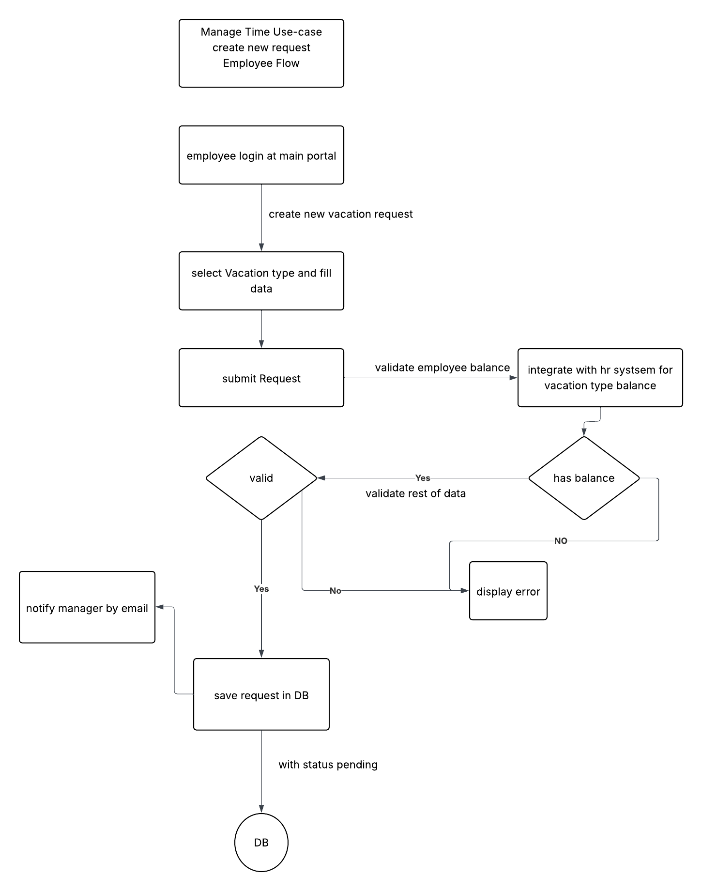
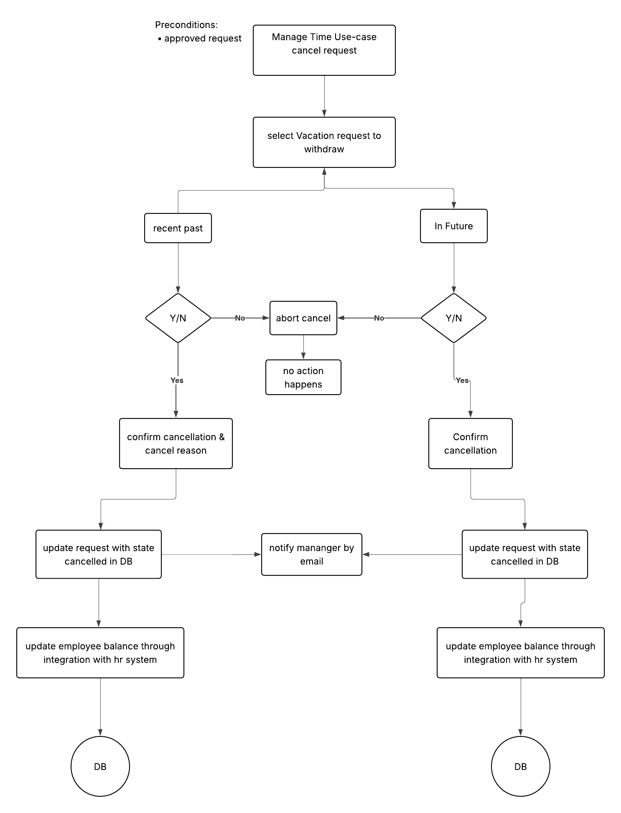
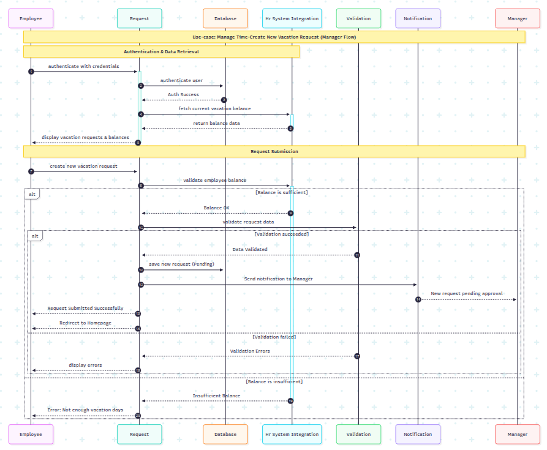
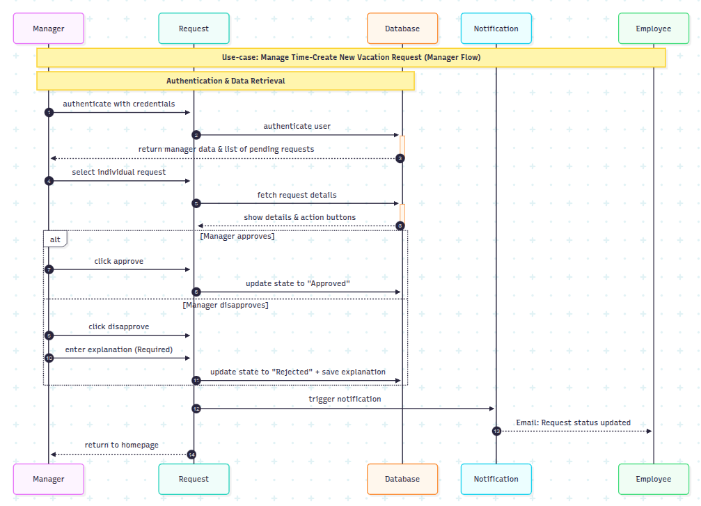
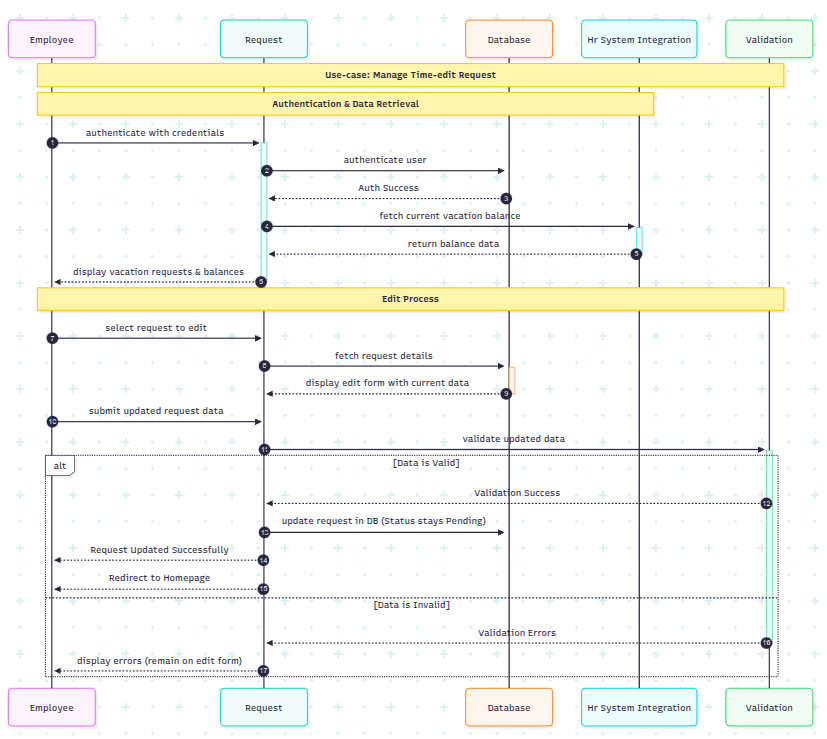
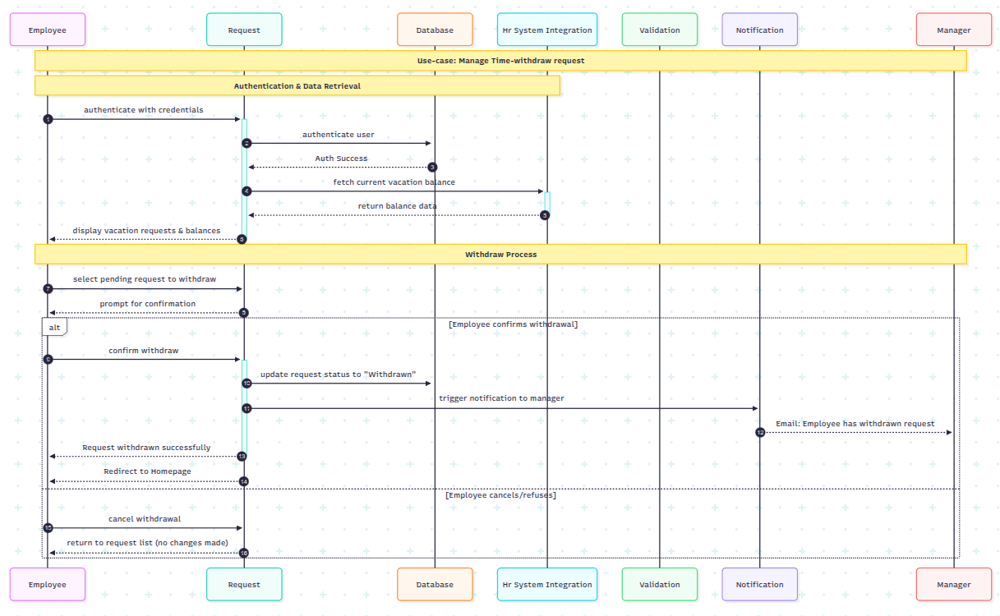
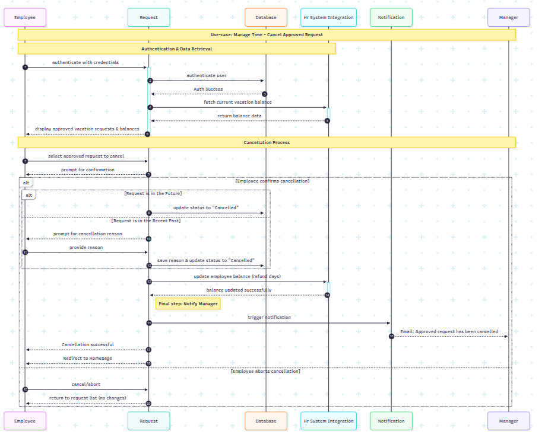

# Vision

A Vacation Tracking System (VTS) will provide individual employees with the capability to manage their own vacation time, sick leave, and personal time off, without having to be an expert in company policy or the local facility’s leave
policies.

# Functional Requirements

1. Implements a flexible rules-based system for validating and verifying leave time requests
2. Enables manager approval (optional)
3. Provides access to requests for the previous calendar year, and allows requests to be made up to a year and a half in the future
4. Uses e-mail notification to request manager approval and notify employees of request status changes
5. Uses existing hardware and middleware
6. Is implemented as an extension to the existing intranet portal system, and uses the portal’s single-sign-on mechanisms for all authentication
7. Keeps activity logs for all transactions
8. Enables the HR and system administration personnel to override all actions restricted by rules, with logging of those overrides
9. Allows managers to directly award personal leave time (with system-set limits)
10. Provides a Web service interface for other internal systems to query any given employee’s vacation request summary
11. Integrate with the HR department legacy systems to retrieve required employee information and changes

# Non-Functional Requirements

1. The system must be easy to use(reusable)
2. Save time and money mostly in the HR department
3. Improve the internal business processes of this organization, at least with respect to the time it takes to manage vacation time requests

## Constraints

1. Integration: Integrate with HR department legacy systems to retrieve employee information and changes
2. Single-Sign-On (SSO): The VTS must use the Central Authentication Service (CAS) for user identification, as it is an extension of the existing company intranet portal
3. Hardware: Uses existing hardware
4. Integration as an Intranet Extension : The VTS is explicitly defined as an extension of the existing company intranet portal
   . By building it as a Web-centric application integrated into the current infrastructure, the system provides a natural entry point for users who are already familiar with the company's internal tools

## Manage Time Use Case Diagrams

### Entity Relationship Diagram

[View Live ERD on dbdiagram.io](https://dbdiagram.io/d/69da41f18089629684718610)

### Flowcharts

Create New Request (Employee)

Create New Request (Manager)

Edit Request

Withdraw Pending Request

Cancel Request

### Sequence Diagrams

Create New Request (Employee)

Create New Request (Manager)

Edit Request

Withdraw Pending Request

Cancel Request
